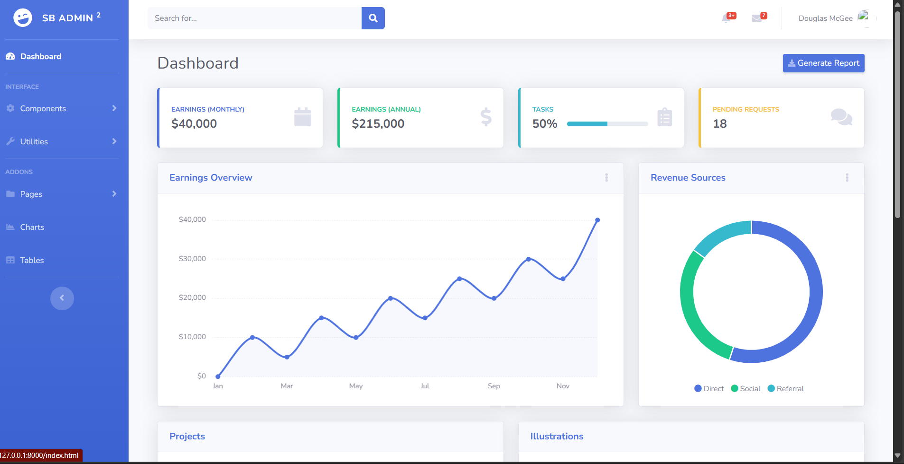

# Setup Awal Project Laravel 12 dengan Breeze & SB2 Admin Template
Repositori ini berisi panduan dan template dasar untuk memulai project Laravel 12 dengan PHP, menggunakan Laravel Breeze sebagai starter kit autentikasi, serta integrasi SB2 Admin Template. Cocok sebagai fondasi setup awal project dari skala minimum hingga menengah, sehingga pengembangan aplikasi menjadi lebih mudah dan terstruktur.

## Fitur

- Laravel 12 sebagai framework utama
- Laravel Breeze untuk autentikasi sederhana dan siap pakai
- Integrasi SB2 Admin Template untuk tampilan dashboard modern
- Struktur project siap dikembangkan sesuai kebutuhan aplikasi



## Prasyarat

- PHP >= 8.2
- Composer
- Node.js & npm
- Database (MySQL, PostgreSQL, dll.)

## Langkah Instalasi

1. **Clone repositori**
    ```bash
    git clone <url-repo-anda>
    cd <nama-folder>
    ```

2. **Install dependensi PHP**
    ```bash
    composer install
    ```

3. **Salin file environment**
    ```bash
    cp .env.example .env
    ```

4. **Generate application key**
    ```bash
    php artisan key:generate
    ```

5. **Konfigurasi database**  
    Edit file `.env` sesuai konfigurasi database Anda.

6. **Install Laravel Breeze** // (opsional jika belum terinsall brezee)
    ```bash
    composer require laravel/breeze --dev
    php artisan breeze:install
    npm install
    npm run dev
    ```

7. **Jalankan migrasi**
    ```bash
    php artisan migrate
    ```

8. **Integrasi SB2 Admin Template** // (opsional di sesuaikan jika bisa)
    - Salin file SB2 Admin Template ke folder `public` sesuai struktur template.
    - Ubah layout utama (`resources/views/layouts/app.blade.php` atau sesuai kebutuhan) menggunakan layout SB2.
    - Pastikan asset CSS & JS SB2 sudah di-link di file layout, contoh:
      ```blade
      <link rel="stylesheet" href="{{ asset('template-admin/css/sb-admin-2.min.css') }}">
      <script src="{{ asset('template-admin/js/sb-admin-2.min.js') }}"></script>
      ```
    - Sesuaikan tampilan halaman auth (login, register, dsb.) agar menggunakan layout SB2.

9. **Jalankan aplikasi**
    ```bash
    php artisan serve
    ```


Pastikan file gambar sudah ada di path yang sesuai pada project Anda.

---

## 📁 Struktur Folder Setelah Refactor

```
resources/views/
├── layouts/
│   └── app.blade.php        # Layout utama
│
├── partials/                # Komponen layout terpisah
│   ├── head.blade.php       # <head> (title, meta, css) (coming soon)
│   ├── sidebar.blade.php    # Sidebar navigasi
│   ├── topbar.blade.php     # Navbar atas
│   ├── footer.blade.php     # Footer bawah
│   └── scripts.blade.php    # Script JS (coming soon)
├── dashboard/
│   └── index.blade.php
```

---

## 🔧 Ringkasan Refactor

| Komponen          | Sebelum (Langsung di layout) | Sesudah (Menggunakan `@include`)      |
|-------------------|------------------------------|---------------------------------------|
| Head HTML         | Di `app.blade.php`           | `@include('partials.head')`           |
| Sidebar           | Di `app.blade.php`           | `@include('partials.sidebar')`        |
| Topbar            | Di layout utama              | `@include('partials.topbar')`         |
| Footer            | Di bagian bawah layout       | `@include('partials.footer')`         |
| Script JS         | Di akhir layout              | `@include('partials.scripts')`        |
| Dashboard Content | Langsung di layout           | `@yield('content')` + `@extends()`    |

## ✅ Tujuan Refactor

- Memisahkan layout utama menjadi bagian modular
- Memudahkan pemeliharaan dan pengembangan
- Menyederhanakan struktur view Laravel